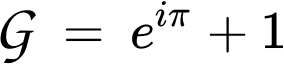

# Giacomonday

Everything one needs to know about Giocomonday.

 * What: Giacomonday: informal scientific discussion, see [https://github.com/richelbilderbeek/giacomonday](https://github.com/richelbilderbeek/giacomonday)
 * Where: De Minnaar, Kleine Rozenstraat 64, [www.deminnaar.nl](http://www.deminnaar.nl)
 * When: see dates below, at each date from 20:00 onwards
 * Topic: see below

## Future discussions

Date|Topic
---|---
2018-09-24|Adaptive radiation in Uranium-235
2018-10-08|[no topic yet, feel encouraged to submit one]
2018-10-22|[no topic yet, feel encouraged to submit one]

## Discussed

Date|Topic
---|---
2018-02-19|The effect of quantum physics at macro-evolutionary scale
2018-02-26|The effect of intergalactic dark matter at micro-evolutionary scales
2018-03-05|Emergent properties in single-rule single-agent systems in featureless donut-shaped worlds
2018-03-12|The effect of black holes on the retinal system of bottom-dwelling ciclids in Lake Victoria in winter when it is cloudy 
2018-03-19|[An unofficial Giacomonday]
2018-03-26|The effect of alternative universes on Darwinian sexual selection on costless and honest traits on species in those universes
2018-04-09|Practice of evolutionary medicine by Mesoamericans in Teotihuacan at March 14th 159 AD 
2018-04-23|in silico modeling of perfect vacua
2018-04-30|Evolutionary stable strategies for bachelor students in a game of heads or tails  
2018-05-07|The effect of waterbody names on mitochondrial cAMP levels in flagellated microbenthos
2018-05-14|(extra) Approaches to Macroevolution: 3. General Variation and Origin, Overarching Issues, General Acknowledgements
2018-05-21|The effect of Pentecost on Giacomondays (spoiler: none!)
2018-05-28|The effect of typo's in email sent early in the morning on biological simulations running on the same computer
2018-06-04|The amount of pre-emptive niche filling by absent species
2018-06-11|Extra Giacomonday. The effect of having no topic on Giacomondays
2018-06-18|Origin of life: a virgo? The effect of the zodiac on early replicator formation 
2018-07-02|The effect of eddies in vacua in Italian natural reserves
2018-07-16|The absence of host-parasite interactions in My Little Pony, excluding gray area cases 
2018-07-30|Host-parasite relations in hosts confined to the Artic and parasites confined to the Antarctic region 
2018-08-13|The effect of time travelling haplorhines on yesterday's unobservable behavioral dynamics
2018-08-27|Survival of the fittest? The effect Charles Darwin had on the Chinese Ming dynasty
2018-09-10|Sexual ornaments producing electromagnetic radiation of wavelengths between 41 and 43 femtometers
2018-09-17|(at 21:00!) The effect of a one-hour daytime shift on observable circadian behavior of Tardigrada in liquid helium 

## FAQ

### At what time will the topic be discussed?

Discussion starts at 20:00 sharp, until a 
consensus is reached. Sometimes the discussion
flares up again later on the evening, but this
is not encouraged.

### I know little about the topic, can I join anyways?

Great care is taken in selecting topics with only
a modest amount of literature about it. If a literature
search on the topic results in more articles 
than the Giacoconstant, a more specific topic is picked. 

Short as the list of academic papers may be, 
we do (try to) accept people 
that may potentially have good reasons not to read up.

### I want to contribute a topic

Great! Send a Pull Request, Issue or email to @richelbilderbeek.

### I only want to join for the gezelligheid. Is that OK?

As can be inferred from the list of topics, we do not
take science lightly. Sure, we will (try to) be nice
to you, but we may be hindered of the idea that we 
view you as parasitically bathing in our hard-earned 
wisdom. On the other hand, perhaps we should slow
down on being serious all the time.

### Who is the guy in the picture?

That, is Giacomo!

### What is the Giacoconstant?

The Giacoconstant, G, can be calculated as such:

The 'plus one' is to emphasize that we are always
willing to read that one extra article.

### Don't you think a Monday is a bad day to go to a pub?

Yes. Some of the wiser visitors of Giacomonday thus leave at 22:00.

## History

### First era: 2014-2015

Giacomonday started in the era in which TECE was a member of COCON. In that era,
Richel Bilderbeek and Annelies van Ginkel were the two Party Committee members.
During that period, the pub was frequented once a week for six weeks in a row. Then,
Giacomo Alciatore, an examplary student went elsewhere. This resulted in Richel being
in the pub alone, and Giacomonday (not yet called as such) died a silent death. Also,
TECE split from COCON.

### Second era: 2016

In the second era, Giacomo visited Groningen for some weeks, and Giacomonday was
back! It was then named as such. When Giacomo left, Richel was again the only
one persevering in being social, and Giacomonday was put in the freezer.

### Third era: 2017-onwards

The TECE group has grown, with some new social members being added. Giacomonday
was revived, with Giacomono being absent (he does get the invitation 
email, though). The Giacomonday got an even more serious character, by 
adding a scientific topic to be informally discussed.
