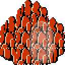
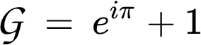

# Keivrijdag/Creagfriday

Branch  |
--------|-----------------------------------------------------------------------------------------------------------------------------------------
`master`|

Everything one needs to know about the Keivrijdag/Creagfriday.

 * What: Keivrijdag/Creagfriday: informal scientific discussion, 
   see [https://github.com/richelbilderbeek/keivrijdag](https://github.com/richelbilderbeek/keivrijdag)
 * Where: Locaties varies, see schedule 'Future discussions' below
 * When: see dates below, at each date from 20:00 onwards
 * Topic: see below

## Future discussions

Date      |Topic                                                                                                          |Keivrijdag/Groningen location                                               |Stirling/Creagfriday location
----------|---------------------------------------------------------------------------------------------------------------|----------------------------------------------------------------------------|-----------------------------------------------------------------------------------
2020-02-07|[Extra Keivrijdag] Evidence for diversity-dependent speciation in wild Haggis                                  |De Minnaar, Kleine Rozenstraat 64, deminnaar.nl                             |Mo Chreach!
2020-02-14|The effect of tattoos of prime numbers in attracting non-conspecific mates                                     |.                                                                           |.
2020-02-28|The many proofs the universe would be unstable would mature pine forests not be green                          |.                                                                           |.
2020-03-13|The effect of memorizing the digits of pi in attracting non- and conspecific mates                             |.                                                                           |.
2020-03-27|Anecdotal evidence that Humo sapiens men do not always mate with people they classify as 'me mates'            |.                                                                           |.
2020-04-10|.                                                                                                              |.                                                                           |.

## Discussed

### Third Era, second year

Date      |Topic                                                                                                          |Keivrijdag/Groningen location                                               |Stirling/Creagfriday location
----------|---------------------------------------------------------------------------------------------------------------|----------------------------------------------------------------------------|--------------------------------------------------------------
2019-11-08|The many good reasons to classify microplastics as sessile bacteria without DNA                                |De Prins, Zwanestraat 3                                                     |[not yet]
2019-11-22|Effects on biodiversity when painting black holes orange                                                       |[De Sleutel](http://cafedesleutel.nl), Noorderhaven 72                      |[not yet]
2019-12-06|Phenotypic plasticity in unobservable organisms                                                                |[De Graanrepubliek](https://cafedegraanrepubliek.nl), Gedempte Kattendiep 11|[not yet]
2019-12-20|The evolution of the evolution of the evolution of evolvability                                                |Bar de Rits, Pottebakkersrijge 2                                            |[not yet]
2020-01-03|The need of a mutator strain of *Aldabrachelys gigantea* to be used as a model species in evolutionary biology |The Crown, Gedempte Zuiderdiep 2                                            |[not yet]
2020-01-10|[Extra Keivrijdag] The effect of mainland extinction on island size                                            |De Minnaar, Kleine Rozenstraat 64, deminnaar.nl                             |[not yet]
2020-01-17|Application of island biogeography models on islands in marine lakes                                           |Cafe De Molleboon, Nieuwe Ebbingestraat 117                                 |[The Curly Coo Bar, 51 Barnton St](http://www.curlycoobar.com)
2020-01-31|Causes of the lack of mature pine forests on reservoir land-bridge islands                                     |De Kale Jonker, Gedempte Zuiderdiep 148, http://www.cafekalejonker.nl       |Nicky-Tams, 29 Baker Street, [https://www.nickytams.com](https://www.nickytams.com)

Date      |Topic                                                                                     |Location
----------|------------------------------------------------------------------------------------------|---------------------------------------------------------
2019-05-24|(first KeiVrijdag) Applications of the DAISIE model on the sub-oceanic island of Flevoland|[De Toeter](https://www.cafedetoeter.nl/), Turfsingel 6
2019-06-07|[a forgotten Keivrijdag]                                                                  |[no suggestion] 
2019-06-21|Can we exclude genetics in explaining altostratus behavior? Can the absence of emergent properties in its flocking behavior be explained completely by phenotypic plasticity?|[Merleyn, Meeuwerderweg 121](https://www.openstreetmap.org/node/2748526728#map=19/53.21060/6.57925)
2019-07-05|Allopatric speciation in Patrae (but not due to mountain formation)|Bij Kimmie (formerly: Aan De Amstel), Veemarktstraat 101 (close to Oosterpoort)
2019-07-19|The use of English and French Pokemon in measuring name-dependent speciation rates|[Kroeg van Klaas](http://www.kroegvanklaas.nl), [Oosterweg 26](https://www.openstreetmap.org/node/2748530894)
2019-08-02|Evidence from island biogeography models for Flevoland being a volcanic island|[De Pintelier](https://www.depintelier.nl), [Kleine Kromme Elleboog 9](https://www.openstreetmap.org/node/2752227627) 
2019-08-16|Biological relevance of speciation models in which time is diversity-dependent|Noorderzon, Kruissingel
2019-08-30|Phylogenetic speciation models that use pi in their likelihood equations|Die 2, Mauritsdwarsstraat 29, [https://www.openstreetmap.org/node/2748531453](https://www.openstreetmap.org/node/2748531453)
2019-09-13|Biological relevance of protracted diversity-and-time-and-trait-dependent multiple-birth speciation models with imaginary parameters|De Minnaar, Kleine Rozenstraat 64, [https://deminnaar.nl](https://deminnaar.nl)
2019-09-27|Biological relevance of divisions by zero|Mr Mofongo's, Oude Boteringestraat 26
2019-10-11|The reaction of flogs to valkan drones|De Bres, Grachtstraat 71
2019-10-25|the effect of biodifurstetie of difrend kinds of islands on the evelution on islands|Sportsbar, Blauwborgje 16
2019-11-01|[Extra Keivrijdag] The evolutionary consequences of naming a sterilized pets after a phylogenetic inference model|@GiorgioBoccarella's place

Date      |Topic
----------|------------------------------------------------------------------------------------
2019-02-25|(from 17:00!)The Giacomonday topic with the highest impact factor judged by altmetrics
2019-03-11|The use of introgression to prove Foraminifera and Ovis aries are non-sister species
2019-03-25|Emergent properties of multiple adjacent vacua
2019-04-08|Does the absence of division of labor in Higgs bosons prove they aren't social insects?
2019-04-22|The effect of Easter on Giacomondays (spoiler: none!)
2019-05-06|(last Giacomonday) Dominance hierarchies in photons

### Third Era, first year

Date      |Topic
----------|----------------------------------------------------------------------
2018-02-19|The effect of quantum physics at macro-evolutionary scale
2018-02-26|The effect of intergalactic dark matter at micro-evolutionary scales
2018-03-05|Emergent properties in single-rule single-agent systems in featureless donut-shaped worlds
2018-03-12|The effect of black holes on the retinal system of bottom-dwelling ciclids in Lake Victoria in winter when it is cloudy 
2018-03-19|[An unofficial Giacomonday]
2018-03-26|The effect of alternative universes on Darwinian sexual selection on costless and honest traits on species in those universes
2018-04-09|Practice of evolutionary medicine by Mesoamericans in Teotihuacan at March 14th 159 AD 
2018-04-23|in silico modeling of perfect vacua
2018-04-30|Evolutionary stable strategies for bachelor students in a game of heads or tails
2018-05-07|The effect of waterbody names on mitochondrial cAMP levels in flagellated microbenthos
2018-05-14|(extra) Approaches to Macroevolution: 3. General Variation and Origin, Overarching Issues, General Acknowledgements
2018-05-21|The effect of Pentecost on Giacomondays (spoiler: none!)
2018-05-28|The effect of typo's in email sent early in the morning on biological simulations running on the same computer
2018-06-04|The amount of pre-emptive niche filling by absent species
2018-06-11|Extra Giacomonday. The effect of having no topic on Giacomondays
2018-06-18|Origin of life: a virgo? The effect of the zodiac on early replicator formation 
2018-07-02|The effect of eddies in vacua in Italian natural reserves
2018-07-16|The absence of host-parasite interactions in My Little Pony, excluding gray area cases 
2018-07-30|Host-parasite relations in hosts confined to the Artic and parasites confined to the Antarctic region 
2018-08-13|The effect of time travelling haplorhines on yesterday's unobservable behavioral dynamics
2018-08-27|Survival of the fittest? The effect Charles Darwin had on the Chinese Ming dynasty
2018-09-10|Sexual ornaments producing electromagnetic radiation of wavelengths between 41 and 43 femtometers
2018-09-17|(at 21:00!) The effect of a one-hour daytime shift on observable circadian behavior of Tardigrada in liquid helium 
2018-09-24|Adaptive radiation in Uranium-235
2018-10-01|The effect of Heliconius migrational routes on biodiversity patterns in Mare Imbrium 
2018-10-08|The epidemiological effects of vaccinating viruses against themselves 
2018-10-15|Evidence for the sexy son hypoKeivrijdag in the European pied flycatcher (Ficedula hypoleuca) from observational field studies of virgin females 
2018-10-22|The use of Bayesian statistics on deterministic, non-chaotic and trivally simple systems 
2018-11-05|The delusion of the Division of Labor in ants: no evidence of parlementary or other adminstrative divisions  
2018-11-19|Post-mortem game theory strategies
2018-12-03|What can agriculture learn from the low FST values in Cybertronian species?
2018-12-17|Successes in stabilizing road kills in the Caspian tiger (Panthera tigris tigris) in the last decade
2018-12-31|No Giacomonday
2019-01-14|Paper-Rock-Scissors dynamics in collections of papers, rocks and scissors
2019-01-21|[Extra Giacomonday) Correlation between narcissism and throat patch shape (e.g. not in the shape of a penis) in tayra (Eira barbara)
2019-01-28|Pokemon: ideal system to test diversification models on?
2019-02-11|The use of island biogeography in explaining low species diversity on the moon

## FAQ

### At what time will the topic be discussed?

Discussion starts at 20:00 sharp, until 
consensus is reached. Sometimes the discussion
flares up again later on the evening, but this
is discouraged.

### I know little about the topic, can I join anyways?

Great care is taken in selecting topics with only
a modest amount of literature about it. If a literature
search on the topic results in more articles 
than the Giacoconstant, a more specific topic is picked. 

Short as the list of academic papers may be, 
we do (try to) accept people 
that may potentially have good reasons not to read up.

### I want to contribute a topic

Great! Send a Pull Request, post an Issue 
or email to @richelbilderbeek or @TheoPannetier.

This will open up the option to suggest a pub in
Groningen, Stirling or both. You are encouraged to do so :+1:

### I only want to suggest a pub!

Bad luck! You need to suggest a topic :rainbow: 

### I only want to join for the gezelligheid. Is that OK?

As can be inferred from the list of topics, we do not
take science lightly. Sure, we will (try to) be nice
to you, but we may be hindered of the idea that we 
view you as parasitically bathing in our hard-earned 
wisdom. On the other hand, perhaps we should slow
down on being serious all the time.

### What is it with that Keivrijdag/Creagfriday?

The same event is organised in parallel in Groningen
and Stirling. See the rich history of these events below. 

### Why is it called Keivrijdag?

'kei' is Dutch for 'very' and 'vrijdag' is Dutch for Friday.
Additionally, 'vrij' is Dutch for 'free' as used in 'freedom' (among others),
so it is a very free Friday! 

### Why is it called Creagfriday?

'creag' is Scottish Gaelic for rock.
The 'Kei' in Creagfriday's ancestral event 'Keivrijdag' is
a Dutch word for 'rock'.

### Is the Keivrijdag related to the KEI week?

No.

The 'kei' in 'kijvrijdag' is Dutch for 'very', 
where KEI in KEI week is an abbreviation.

There is a 50% chance, however, that in a KEI week's Friday, 
that that day is also a Keivrijdag.
Additionally, there is an approximately 2% chance, 
that when it is Keivrijdag, it is also KEI week.

### What is the picture?

It is a rock. 

To be precise, it is one of the two rocks
at [Spectacle Rock](https://zelda.fandom.com/wiki/Spectacle_Rock).

'Kei' is a Dutch word for rock.

### What is the Giacoconstant?

The Giacoconstant, G, can be calculated as such:

The 'plus one' is to emphasize that we are always
willing to read that one extra article.

### Don't you think Friday is a bad day to go to a pub?

Yes. Some of the wiser visitors of Keivrijdag thus leave at 22:00.

## History

The history of Keivrijdag started with the Giacomonday:

### First era: 2014-2015

Giacomonday started in the era in which TECE was a member of COCON. In that era,
Richel Bilderbeek and Annelies van Ginkel were the two Party Committee members.
During that period, the pub was frequented once a week for six weeks in a row. Then,
Giacomo Alciatore, an examplary student went elsewhere. This resulted in Richel being
in the pub alone, and Giacomonday (not yet called as such) died a silent death. Also,
TECE split from COCON.

### Second era: 2016

In the second era, Giacomo visited Groningen for some weeks, and Giacomonday was
back! It was then named as such. When Giacomo left, Richel was again the only
one persevering in being social, and Giacomonday was put in the freezer.

### Third era: 2017-onwards

The TECE group has grown, with some new social members being added. Giacomonday
was revived, with Giacomono being absent (he does get the invitation 
email, though). The Giacomonday got an even more serious character, by 
adding a scientific topic to be informally discussed.

After 1.25 year of Giacomondays, this event moved to a Friday and was 
renamed to 'Keivrijdag'. At the Keivrijdag, the pub location varies.

At around November 2019, a Keivrijdag regular, Theo Pannetier,
decided to enrich the Scottish culture in Stirling by organising
a Keivrijdag there in parallel, where it will be called 'Creagfriday'.
